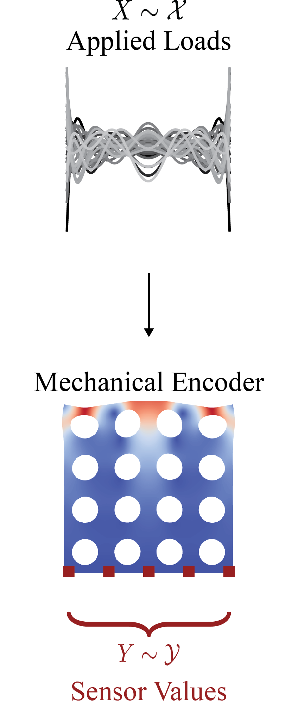

# Code Repository for: "Information Propagation and Encoding in Solids: A Quantitative Approach Towards Mechanical Intelligence"
<p align="center">

</p>
This repository accompanies this preprint:
[Information Propagation and Encoding in Solids: A Quantitative Approach Towards Mechanical Intelligence](https://arxiv.org/abs/2602.00140).
In brief, this work uses information theory to formaulate quantitative framework for mechanical intelligence.


Here is quick overview of each directory. Directories marked with legacy code are not used for the paper. 
Further details about each script and siubdirectory can be found in the READMEs located in each directory.

## Installation
First, to ensure that al dependencies are installed, we provided the conda environment file. 
Additionally, everything in the `utils` can be installed with pip. The simplest way to run code from this repository is to first create a conda environment file then pip still the git repo. The bash commands to do so are:
```bash
    git clone https://github.com/pprachas/info_mech.git # clone the git repo
    conda env create -f environment.yml # create conda environment file
    cd info_mech
    pip install . # pip install functions in the utils diretory
```
    
## Directories
|Directory|Description|
|---------|-----------|
|fenicsx_mi|directory for all the FEniCSx code used in the publication. This directory includes code for parameter space exploration and Bayesian Optimization. Both the FEA components and mutual information computation is found in this directory.|
|fenicsx_scripts|scripts for simple problem in linear elastic FEA in FEniCSx (all legacy code)|
|half_space|directory containing code for elastic halfspace. This includes code for both symbolic integration of Flamant's solution and mutual information computations.|
|utils|scripts for all functions used in this work|
|validation|code validation for analytical solution and information estimates (all legacy code)|

Note that legacies files and directories are not cleaned but are not used to reproduce results in the paper.

##  Pytests

We have provided pytests for our entropy estimator based the KSG estimator implement with NPEET, the relative entropy based on [Accurate estimation of the normalized mutual information of multidimensional data](https://pubs.aip.org/aip/jcp/article/161/5/054108/3306182/Accurate-estimation-of-the-normalized-mutual). 

More details on the tests implement and expected test failures can be found inside the directory.

to run pytest with complete information on skips and xfails (expected failures) run:
```bash
pytest -rxs tests/
```

## Citing

If you find anything in this repository useful, it is appreciated if you cite the following paper:

    @article{prachaseree2026information,
      title={Information Propagation and Encoding in Solids: A Quantitative Approach Towards Mechanical Intelligence},
      author={Prachaseree, Peerasait and Lejeune, Emma},
      journal={arXiv preprint arXiv:2602.00140},
      year={2026}
    }


